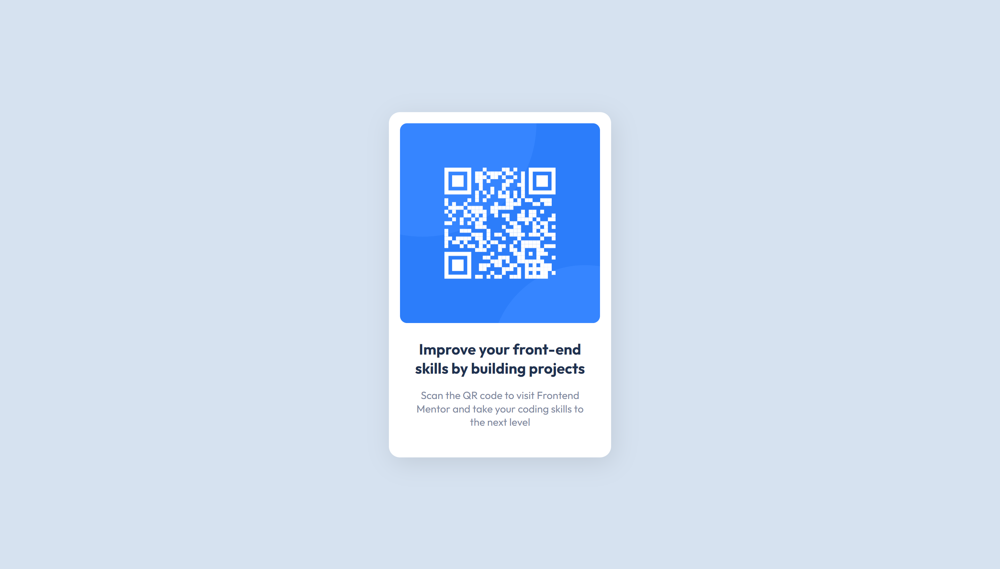

# Frontend Mentor - QR code component solution

This is a solution to the [QR code component challenge on Frontend Mentor](https://www.frontendmentor.io/challenges/qr-code-component-iux_sIO_H). Frontend Mentor challenges help you improve your coding skills by building realistic projects. 

## Table of contents

- [Overview](#overview)
  - [Screenshot](#screenshot)
  - [Links](#links)
- [My process](#my-process)
  - [Built with](#built-with)
  - [Continued development](#continued-development)
  - [Useful resources](#useful-resources)
- [Author](#author)
- [Acknowledgments](#acknowledgments)

## Overview

### Screenshot

### Links

- Solution URL: [https://github.com/ezequielsan/qr-code-component](https://github.com/ezequielsan/qr-code-component)
- Live Site URL: [https://ezequielsan.github.io/qr-code-component/](https://ezequielsan.github.io/qr-code-component/)

## My process

### Built with

- Semantic HTML5 markup
- CSS custom properties
- Mobile-first workflow

### Continued development

I intend to continue practicing my skills in HTML, CSS and the mobile first development methodology.

### Useful resources

- [HTML elements reference](https://developer.mozilla.org/en-US/docs/Web/HTML/Element) - This web page provides documentation of HTML elements and their properties.
- [CSS reference](https://developer.mozilla.org/en-US/docs/Web/CSS/Reference) - This web page provides documentation of CSS properties.

## Author

- Codewars - [Ezequiel Santos](https://www.codewars.com/users/Ezequiel%20Santos)
- Frontend Mentor - [@ezequielsan](https://www.frontendmentor.io/profile/ezequielsan)

## Acknowledgments

I thank the frontend mentor for the variety of challenges to train the skills in the main technologies of the frontend stack. And I thank myself for the effort put into solving this challenge.
